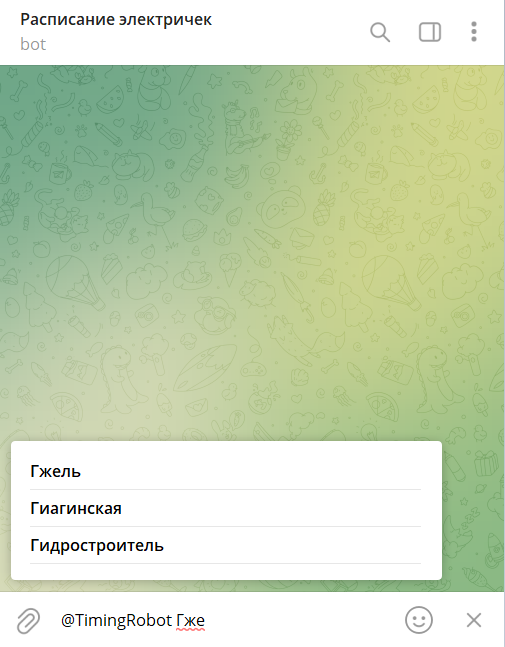

# Развертывание
1. Запустить базу данных Tarantool
```
docker-compose up -d
```
2. Установить Python-библиотеки
```
pip install -r requirements.txt
```
3. Наполнить базу данных данными
```
python init.py
```
4. Запустить телеграмм-бота
```
python bot.py
```

# Конфигурация
Конфигурация бота хранится в `config.ini`. Параметры:

TELEGRAM
- API_TOKEN - API-токен телеграмм-бота

YANDEX
- API_ADDRESS - адрес API Yandex.Расписания
- API_TOKEN - API-токен Yandex.Расписания

STORAGE
- DB_NAME - название базы данных Tarantool
- DB_HOST - адрес базы данных Tarantool
- DB_PORT - порт базы данных Tarantool

# Инструкция по использованию бота
1. Необходимо в телеграмме найти бота @TimingRobot
2. Отправить боту команду /start для активации бота
3. Для работы с inline-ботом необходимо в сообщение ввести "@"

4. Появятся варианты выбора бота или пользователя
5. Выбираем бота "Расписание электричек"

6. Начнем вводить название станции отправления

7. Бот предложит несколько вариантов станций
8. Выберем нужную станцию отправления

9. В ответ бот пришлет расписание электричек на сегодня с указанием направления. При этом ушедшие электрички не будут выводится в ответе. Если кликнуть на время отправления, то можно перейти сайт Яндекс.Расписания и посмотреть детальную информацию по данному маршруту.